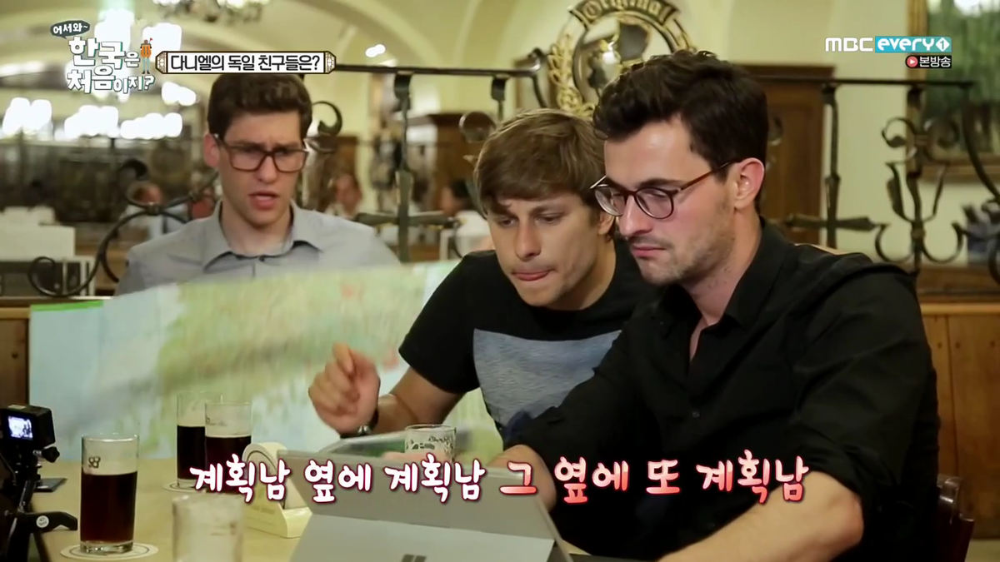

# 1편 독일 왕국의 시작

1076~1077년 겨울, 유럽에 기록적 추위가 찾아왔다. 프랑스의 센강같이 작은 강은 물론 독일의 라인강과 같은 큰 강도, 심지어 따뜻한 기후의 북부 이탈리아 포강도 꽝꽝 얼어붙을 정도였다. 이 매서운 추위 속에 수도사 행색의 한 남자가 서 있었다. 그 남자는 수도사들이나 입는 얇고 거친 옷을 입고 있었고 신발도 신지 않았다. 그 수도사는 누구를 기다리는 듯, 용서를 구하는 듯 굳게 닫힌 카노사 성문 앞에서 하염없이 있었다. 먹지도 않고 추위에 떨기를 3일째 되는 날, 마침내 카노사 성문이 열렸다. 그제야 그 수도사는 자리에서 일어났다. 그 수도사의 이름은 하인리히 4세(Heinrich IV) - 독일과 프랑스 일부, 북부 이탈리아를 지배하고 있는 신성로마제국의 황제였다. 성문을 열고 하인리히를 불러들인 인물은 교황 그레고리우스 7세(Gregorius VII)였다. 

----

2017년~2018년 모 방송국에서 방영한 “어서 와, 한국은 처음이지”라는 TV프로그램이 큰 인기를 끌었다. 한국을 방문해본 적이 없는 외국인 청년들이 한국에 와서 한국 문화를 처음 마주했을 때 당혹감, 신기함 등의 반응을 재미있게 편집한게 인기 비결이다. 이 외국인 친구들의 반응 외에도 한 가지 눈여겨볼 점은 한 명이 아니라 3명 이상의 친구들이 초대되다보니 각 나라 특유의 행동 습성도 자연스럽게 나타난다는 점이다. 특히 독일에서 온 남자 3명의 행동 습성은 “역시 독일인" 이라는 찬사를 자아내게 했다. 한국에 오기 전 여러 권의 여행 안내 책자를 시험 준비하듯 샅샅이 읽고 이를 바탕으로 짠 여행 계획서는 그 꼼꼼함이 시청자들의 감탄을 끌어내기에 충분했다. 방송에서는 이런 독일인의 철저한 준비성에 초점을 맞춰 시청자들의 눈에 잘 띄지 않은 특징이 있었다. 바로 리더의 지시를 따라 일사불란하게 움직이는 모습이었다.

페터, 마리오, 다니엘 중 가장 리더 기질이 다분한 페터는 누가 시키지도 않았는데 스스로 리더 역할을 했다. 마리오와 다니엘은 페터와 자신들 사이에는 어떠한 신분의 차이가 없음에도 묵묵히 페터의 말을 따랐다. 사실 마리오와 다니엘이 페터의 지시에 ‘네가 뭔데 나한테 명령이냐'라고 싸워도 논리적으로 전혀 이상하지 않다. 하지만 독일인들은 분쟁을 통한 혼란 대신 복종을 통한 질서를 택했다.

---

이런 독일인의 경향에 비추어 볼 때, 독일은 역사적으로 늘 강력한 중앙집권국가였고 히틀러와 같은 절대 권력자가 있었으며 이 절대자의 명령에 일사분란하게 움직여야 했지만 실상은 그 반대였다. 역사적으로 독일은 늘 분열되어 있었다. 이 분열은 1871년에 이르러야 프로이센 왕국을 중심으로 통일을 이루면서 끝이 났다. 통일된 국가의 이름은 ‘독일 제국'이었다. 이름에서 뭔가 강력한 황제의 권력이 느껴지지만, 이름과 달리 황제의 권한은 굉장히 제한적이었다. 독일 제국은 완벽한 중앙집권적 통일이 아니라 현재 미국과 같은 연방제 형태를 취했기 때문이다. 제국 황제는 미국의 대통령처럼 국가(제국)를 대표하고 오직 군사, 외교권만을 지배했다. 이를 반대로 얘기하자면 각 연방과 자유 도시는 군사, 외교권만을 제외하고 상당한 수준의 자치를 누리고 있었다. 1, 2차 세계대전을 겪으면서 황제는 사라지고 대신 총리가 남았지만 지금도 각 지방의 자치 수준은 상당한 수준이다.

<ins class="adsbygoogle"
     style="display:block; text-align:center;"
     data-ad-layout="in-article"
     data-ad-format="fluid"
     data-ad-client="ca-pub-3240698473669508"
     data-ad-slot="6008361880"></ins>

이런 경향은 독일의 역사와 깊은 관련이 있다. 서로마 멸망 이후 게르만족의 일파인 프랑크족이 현재 프랑스 지방을 중심으로 프랑크 왕국을 세웠다. 전성기 프랑크 왕국은 현재 프랑스, 독일, 네덜란드, 벨기에, 체코, 스위스, 오스트리아 전역과 슬로바키아, 크로아티아, 스페인 일부를 아우를 정도로 거대했다. 이런 프랑크 왕국이 계속 이어졌으면 유럽 연합이 1500여 년 일찍 생겼을 수도 있지만, 안타깝게도 843년에 3개의 왕국으로 쪼개진다. 프랑크 왕국의 왕 루이 1세(독일어로는 루트비히 1세)가 죽고 그 당시 프랑크족의 관습인 남자 균일 상속제에 따라 아들 세 명이 왕국을 사이좋게 나눠 가졌기 때문이다. 이른바 '베르됭 조약'인데 이 조약이 현대 프랑스, 독일, 이탈리아의 분기점이 된다. 

베르됭 조약으로 갈라진 프랑크 왕국(출처: [위키피디아](https://commons.wikimedia.org/wiki/File:Vertrag_von_Verdun.svg), Creative Commons Attribution-Share Alike 4.0 International )

큰아들인 로타르 1세는 제국의 중앙 부분을, 둘째 아들 루트비히 2세는 제국의 동쪽을, 막내 아들 샤를은 제국의 서쪽을 차지했다. 이를 각각 중프랑크/동프랑크/서프랑크 왕국이라고 한다. 이중 동프랑크 왕국은 현재 독일의 모태가 되었고 서프랑크 왕국은 현재 프랑스의 모태가 되었다.

이 중 동프랑크 왕국을 집중해서 보자. 루이 1세(혹은 루트비히 1세)의 아들 중 루트비히 2세가 라인강 동쪽을 가져가면서 생긴 동프랑크 왕국은 증손 대인 루트비히 4세에 이르러 왕권이 매우 약해졌다. 루트비히 4세는 유아왕(영: Louis the Child, 독: Ludwig das Kind)이라는 별명에 걸맞게 겨우 7세의 나이로 왕위에 올랐기 때문이다. 어린 나이에 왕위에 오르면 그 국가의 통치 체계가 확고하지 않은 한, 어김없이 귀족들의 힘이 세지는 현상이 동서고금을 막론하고 역사적으로 수없이 많았다. 게다가 몸이라도 건강하면 모를까 루트비히 4세는 허약한 체질이라 자주 아팠기 때문에 왕국의 통치는 전적으로 귀족과 주교의 손에 맡겨졌다. 귀족들은 이 절호의 기회를 자신의 권력 강화에 이용했다. 이 시기 작센, 프랑켄, 바이에른, 슈바벤, 로트링겐 공작령이 상당한 수준의 자치권을 누리게 된다. 

루트비히 2세의 상상화(출처 : [위키피디아](https://commons.wikimedia.org/wiki/File:Ludwig_der_Deutsche,_nach_Trost,_Royal_Collection.jpg), 퍼블릭 도메인)

911년 루트비히 4세는 ‘유아왕’이라는 별명을 떼지도 못한 채 18세에 후사를 남기지 않고 사망했다. 이로써 루트비히 2세부터 내려온 카롤링거 왕조의 대가 끊기자 동프랑크의 귀족들은 다음 동프랑크 왕위 문제를 논의하기 위해 911년 11월 10일 현 독일 포르크하임(Forchheim)에 모였다.