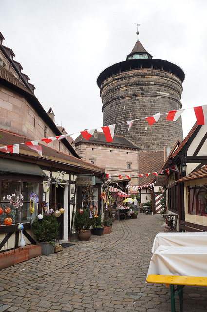

# 황제와 교황(2) - 게르만 사람들의 왕위 선거

독일 최대의 크리스마스 마켓이 열리는 곳, 중세의 모습이 잘 보존되어 있는 곳, 그리고 나치의 발상지이기도 한 독일 뉘른베르크(Nürnberg)에 가면 빨간색과 흰색이 어우러진 문양을 심심찮게 볼 수 있다.

뉘른베르크 성 근처. (출처 : 직접 찍음)

이 문양은 과거 뉘른베르크가 속했던 프랑켄(Franken) 지방의 문장이다. 일명 프랑켄 갈퀴(Fränkischer Rechen)라 불리는 패턴인데, 뉘른베르크뿐만 아니라 과거 프랑켄 지방에 속했던 도시의 문장(Coat of Arms)에는 어김없이 프랑켄 지방의 문장이 들어있다. 아래 사진은 왼쪽(모바일이면 위에서)부터 뉘른베르크, 뷔르츠부르크(Würzburg), 안스바흐(Ansbach)의 문장이다. 모두 빨간색과 하얀색의 프랑켄 지방의 문장을 확인할 수 있다. (출처: 위키피디아)

프랑켄 지방은 천 년 넘는 세월 동안 독립적인 정치세력으로 존재했다. 그러나 19세기 초에 터진 나폴레옹 전쟁에서 바이에른 공국이 프랑스와 반프랑스 사이에서 절묘한 줄타기를 한 결과 프랑켄 지방을 차지하게 되었고 그때부터 바이에른의 일부가 되었다. 지금 이곳이 과거 프랑켄 지방의 일부였다는 사실은 바이에른주의 하위 행정구역인 오버프랑켄/ 미텔프랑켄/ 운터프랑켄 (Ober/Mittel/Unterfranken)현이라는 이름에서만 그 흔적을 찾을 수 있다.

프랑켄 지방과 바이에른 지방의 차이를 느끼고 싶다면 뉘른베르크에서 ICE를 타고 남쪽으로 40분 정도만 가면 된다. 첫 번째 정차지인 잉골슈타트(Ingolstadt)라는 도시는 뉘른베르크와 분위기가 사뭇 다르다. 이 도시에서는 뉘른베르크에서 많이 보던 프랑켄 문양은 눈을 씻고 찾아볼 수 없고 바이에른의 색(푸른색과 흰색)이 대부분이다. 잉골슈타트는 예전부터 바이에른 지방이었기 때문이다. 프랑켄 지역과 바이에른 지역은 사투리도 다른데 과거 바이에른 지역은 Bayerisch라고 부르는 바이에른 사투리를 쓰고 프랑켄 지역은 Fränkisch라는 사투리를 쓴다. 같은 바이에른주지만 말이다.

<ins class="adsbygoogle"
     style="display:block; text-align:center;"
     data-ad-layout="in-article"
     data-ad-format="fluid"
     data-ad-client="ca-pub-3240698473669508"
     data-ad-slot="6008361880"></ins>

---

루트비히 4세가 동프랑크를 통치하는 시절에 성장한 작센, 프랑켄, 바이에른, 슈바벤, 로트링겐 공작령을 동프랑크 및 독일 왕국의 5대 부족 공국(Stem duchy)이라고 한다. 이들 아래 지도는 919 -1125년 당시 중부 유럽의 세력 지도인데, 여기에 5대 부족 공국의 위치가 잘 표시되어 있다. 현재 독일 지도와 같이 보면 좀 더 잘 이해할 수 있다. (출처 : 위키피디아). 5대 부족 공국에 대해서 짧게 설명해보자.

1000년 경 신성로마제국의 세력 지도(출처: 위키피디아, Creative Commons Attribution-Share Alike 3.0 Unported, 2.5 Generic, 2.0 Generic and 1.0 Generic license.)

### 작센 공작령

위 지도에서 맨 위 녹색 영역이다.(지도 상에서 Duchy of Saxony라고 쓰인 부분) 독일어로 Sachsen, 영어로 Saxony라고 한다. 역사 속에서 작센이라 불리는 지역은 현재 독일의 작센주가 아닌 니더작센(Niedersachsen), 작센-안할트(Sachsen-Anhalt), 노르트라인 베스트팔리안(Nordrhein-Westfalen) 일부다. 

영국인의 뿌리인 앵글로-색슨족(Anglo-Saxons)에서 색슨이 바로 게르만 일파인 작센족이다. 작센족은 굉장히 호전적이며 남에게 굴복하기 싫어하는 민족이었다. 프랑크 왕국의 위대한 왕 카롤루스 대제(흔히 샤를마뉴 대제로 알려져 있다)의 전기인 `카롤루스 대제의 생애`을 참고하면 772년 프랑크 왕국의 선공으로 시작된 작센족과 프랑크 왕국과의 전쟁은 810년대에 이르러서야 작센족의 굴복으로 끝이 날 정도였다.
### 프랑켄 공작령

작센 공작령 아래 녹색 영역이다.(지도 상에서 Duchy of Frankonia 라고 쓰인 부분) 독일어로 Franken, 영어로 Frankonia라고 한다. 현재 독일 바이에른주 북부에 해당한다.

### 슈바벤 공작령

프랑켄 공작령 아래 짙은 영역이다. (지도 상에서 Duchy of Swabia 라고 쓰인 부분) 독일어로 Schwaben, 영어로 Swabia라고 한다. 현재 독일 남부 바덴뷔르템베르크 주(Land Baden-Württemberg), 프랑스 알자스 지방 일부, 스위스 동부, 리히텐슈타인을 포함하는 지역이다.

### 바이에른 공작령

슈바벤 공작령 오른쪽 초록색이 바이에른주다(지도 상에서 Duchy of Bavaria 라고 쓰인 부분). 독일어로 Bayern, 영어로 Bavaria라고 한다. 현재 독일 남동부에 있는 바이에른주, 오스트리아 서부 지역이다. 영토에 부침이 있으나 천 년 넘는 긴 시간 동안 현재 뮌헨(Müchen)을 중심으로 한 바이에른 지역에서 독립적인 정치세력으로 존재했다. 독일 통일 당시 프로이센 주도의 독일 제국에 마지못해 따라갔지만 그래도 독일제국과는 별개라는 생각이 굉장히 강했다. 1차 세계대전에 대한 인식도 “프로이센 놈들이 일으킨 전쟁에 어쩔 수 없이 끌려들어 간” 전쟁이라는 인식이 광범위하게 퍼져있을 정도였다.

### 로트링겐 공작령

프랑켄 공작령과 작센 공작령 왼쪽의 진한 녹색과 상대적으로 연한 녹색 지방이다(지도 상에서 Duchy of Upper Lorraine, Duchy of Lower Lorraine). 독일어로 Lothringen, 영어로 Lorraine이다. 현재 프랑스 알자스/로렌 지방, 벨기에, 네덜란드, 룩셈부르크 지방이다. 855년 중 프랑크 왕 로타르 1세가 죽으면서 남자 균일 상속제에 따라 세 개의 나라로 갈라진다. 어디서 많이 보던 모습이긴 하지만(베르됭 조약), 차남 로타르 2세가 알프스 이북의 중 프랑크 왕국을 다스리게 된다. 이 지역을 '로타르가 다스리는 나라라는 뜻'의 'Lotharingia'라고 불리게 되었고 이는 로트링겐(독일어), 로렌(프랑스어)의 어원이 되었다. 참고로 로타르 2세는 적법한 후계자를 남기지 않고 죽어서(869) 로타르 2세의 삼촌이자 동/서 프랑크 왕국의 왕인 루트비히 2세와 샤를이 나눠가지게 되었다.(메르센 조약, 870) 지도 위에서는 상(上, Upper) 로트링겐, 하(下, Lower) 로트링겐으로 나뉘어서 표시되어 있는데, 참고로 상/하의 기준은 알프스 산맥 기준이다. 아무래도 알프스 산맥에 가까워질수록 해발 고도가 높아지기 때문에 상 혹은 ‘높은'이라는 수식어가 붙으며 북해에 가까워질수록 해발 고도 0에 가까워지기 때문에 하 혹은 ‘낮은'이라는 수식어가 붙는다. 참고로 독일 북부, 네덜란드에서 쓰이는 독일어를 ‘저지 독일어'라고 하는데 여기서 저지 역시 낮은 곳(低地)이라는 뜻이다.

다시 이야기를 루트비히 사후 차기 동프랑크 왕위 문제로 돌려보자. 루트비히 4세의 뒤를 이을 유력한 왕위 후보자 중 한 명은 루트비히 4세의 친척이자 서프랑크의 왕인 샤를 3세(Charles III)였다. 카롤링거 왕조의 피를 이어받고 있던 샤를이었기에 혈연을 중시하는 동프랑크 왕국의 왕이 되기에는 이론상으로 전혀 흠이 없었다. 하지만 동프랑크의 공작들은 결코 이를 받아들일 수 없었다. 샤를 3세가 왕위에 오른다는 말은 곧 자신들의 좋은 시절이 끝난다는 말과 같았다. 공작들이 마음대로 다를 수 있었던 전임 왕 루트비히 4세와 달리 샤를 3세는 제일 먼저 자신들의 권력을 제한시킬 것은 불 보듯 뻔했다. 그렇다고 왕조의 피를 이어받지 않은 자를 왕으로 세우기에는 다른 이들을 납득시키기가 힘들었다.

머리를 맞댄 공작들은 절묘한 해법을 찾았는데, 바로 루트비히 4세의 부왕 아르눌프의 딸의 아들 - 루트비히 4세의 외조카이자 자신들과 같은 공작이었던 프랑켄 공작 콘라트(Conrad I)를 동 프랑크 왕으로 선출한 것이다. 콘라트는 작센, 슈바벤, 바이에른 공작의 지지를 얻어 동프랑크 왕국의 왕 콘라트 1세가 되었다. 참고로 콘라트 1세는 스스로 “독일의 왕"(rex Teutonicorum)이라 호칭하지 않았지만 후대에서는 콘라트 1세를 독일 왕국의 시작으로 간주하고 있다.

왕좌에 앉아있는 콘라트 1세(출처 : 위키피디아)

콘라트 1세는 왕이 되었지만, 선거로 뽑힌 왕이고 공작 중 한 명이다 보니 왕권이 극히 약했다. 반장선거로 뽑힌 반장이 친구들한테 엎드려뻗쳐라고 명령하면 “네가 뭔데 감히"라고 코웃음을 칠 터, 어제까지 자신들과 같은 공작이었는데 왕이 되었다고 하루아침에 없던 왕의 권위가 생기지 않는 노릇이다. 게다가 마자르(Magyar)족의 잦은 침략은 안 그래도 불안정한 왕권에 치명상을 입혔다. 마자르족은 907년 프레스부르크 전투 이후 연례행사처럼 1년이 멀다 하고 왕국을 침략했다. 마자르족을 물리치면 왕권 강화에 큰 도움이 될 테지만 콘라트 1세는 이상하리만큼 마자르족의 침공에 일절 대응을 하지 않았다. 마자르족의 격퇴는 오직 각 지방 공작들 몫이었다. 로트링겐 문제도 콘라트 1세의 발목을 잡았다. 즉위 직후 로트링겐 공작은 콘라트 1세를 왕으로 인정할 수 없다며 충성을 거부하고 서프랑크 왕국에 합류해버렸다. 이 때문에 콘라트 1세의 권위는 크게 실추되었다.

사방에서 반란이 들끓었다. 작센 공작 오토(Otto)는 콘라트 1세의 즉위는 찬성했지만 튀링엔(혹은 튀링겐) 지방의 영유권을 두고 콘라트 1세와 무력 충돌이 빈번했다. 이 일로 앙금이 쌓였는지 오토가 죽은 후 아들인 하인리히(Heinrich)가 작센 공작 직을 이어받자 콘라트 1세는 이를 승인하지 않았다. 공작 중 가장 강력한 세력을 가지고 있었던 작센 공작 하인리히는 곧바로 바로 콘라트 1세에 반기를 들었다. 슈바벤 공작은 반란을 일으키지 않는 대신 더 큰 자치권을 요구했고 이를 관철했다. 그것도 모자라서 나중에는 바이에른 공작 아르눌프(Arnulf)와 같이 반란을 일으켰다.

콘라트 1세는 왕국을 안정시키기 위해 사방으로 뛰어다녔다. 반란을 일으킨 바이에른 공작을 군사적으로 진압하고 작센 공작과 평화협정을 맺었다. 서프랑크 왕국으로 넘어간 로트링겐 지방을 되찾기 위해서 프랑크 왕 샤를 3세와 전쟁을 벌이기도 했다. 하지만 군사적으로 재능이 없었는지 아니면 힘이 달려서인지 알 수 없으나 서프랑크로 넘어간 로트링겐 공작령을 끝내 되찾지 못했고 왕국을 침략한 마자르족에게 제대로 대응을 못하는 등 왕국의 혼란을 잠재우지 못했다. 고군분투하고 있던 콘라트 1세에게 예상보다 일찍 종말이 찾아왔다. 다시 반란을 일으킨 바이에른 공작과 싸우던 중 입은 심한 부상으로 콘라트 1세는 재위 만 7년 만인 918년 12월 23일에 사망했다.

콘라트 1세는 왕위를 물려줄 아들이 없었다. 남동생 에버하르트(Eberhard)에 왕국을 물려줘도 무리는 없었지만, 콘라트는 동생 대신 가장 강력한 적수였던 작센 공작 하인리히를 후계자로 지목했다. 독일의 공작 중 가장 세력이 강해서 서프랑크와 왕국을 위협하는 주변 세력 - 마자르족, 슬라브족, 노르만족-에 맞서 왕국을 지킬 수 있는 인물이라 보았기 때문이다. 아니면 평생의 라이벌에게 독일 왕이라는 멍에를 지우는 소심한 복수일지도.
