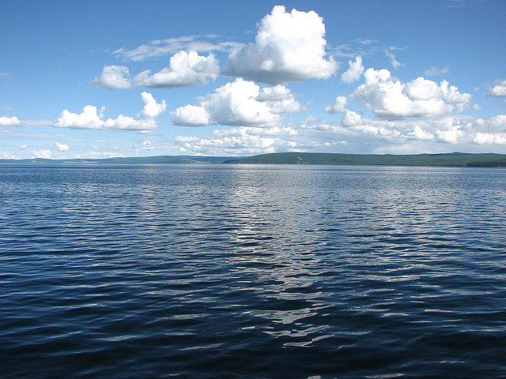
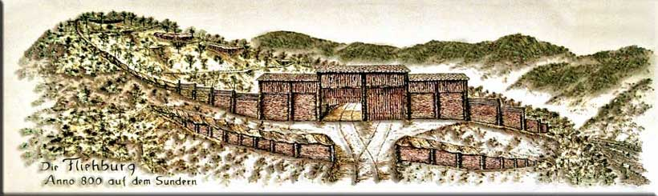

# 하인리히의 반격

몽골의 북쪽에는 홉스골(Khovsgol)이라는 거대한 호수가 있다. 2006년도에 몽골 여행 중 홉스골 호수 2박 3일 승마 트래킹을 한 적이 있었다. 생애 첫 승마라 첫날에는 제대로 말을 몰지 못하고 가이드만 졸졸 따라다니기 바빴는다. 3일 차에서는 나름 전력질주도 하고 나름 말에 익숙해졌다. 나름 기마민족의 후예인가 선천적 재능이 있는가 우쭐해하던 때, 호수 인근에서 한 어린아이를 보았다. 5살 남짓인 꼬마 아이는 안장도 없이 말에 타서 능숙하게 다른 말 두 마리를 몰고 다른 곳으로 이동하고 있었다. 그 순간 나의 자만심은 강렬한 여름 햇살 아래 눈처럼 녹아 없어졌던 기억이 난다.

드넓은 초지에서 가축을 기르며 맹수로부터 가축을 지켜야만 하는 유목민은 어려서부터 남녀노소 할 것 없이 자연스럽게 승마술과 궁술을 몸으로 습득할 수밖에 없었다. 따라서 일상이 곧 군사 훈련이나 마찬가지였다. 유목해야 하는 특성상 평상시 넓은 지역에 흩어져 살지만 일단 모였다 하면 정말 가공할만한 위력을 발휘하곤 했다. 역사적으로 볼 때 4세기경 훈족의 원정 때도, 13세기경 몽골의 아시아 정복 때도 그러했고 마자르족도 마찬가지였다.

---

## 농민 전사의 탄생

924년 마자르족은 또 한 번 작센 지방을 약탈했다. 마자르족은 작센 전역을 내달리며 학살과 약탈을 자행했다. 많은 도시와 요새가 불탔다. 하지만 작센 공작이자 독일 왕인 하인리히 1세는 이번에도 마자르족을 막을 수 없었다. 그저 성을 지키기에 급급했다. 하인리히는 아직 독일 왕국의 군대가 마자르족과 맞서 싸우기에 부족하다는 사실을 잘 알고 있었다. 하인리히는 훈련되지 않은 자신의 군대를 믿지 못했고, 특히 마자르족과 대규모 회전은 무리라고 판단했다.

마자르족의 약탈 때문에 작센 전역이 피폐해졌지만 하인리히는 뜻밖의 행운이 찾아왔다. 924년 우연히 마자르족 고위급 귀족을 사로잡은 것이다. 일설에는 마자르족의 초대 대공 아르파드의 아들인 졸탄이라고 하는데, 졸탄이건 아니건 협상카드로 쓸 만한 지도자급 고위 귀족인 건 확실했다. 926년 하인리히는 이 귀족을 풀어주고 마자르족에 매년 공물을 바치는 조건으로 마르족과 9년의 평화조약을 맺었다. 사실 마자르족의 입장으로서는 전혀 마다할 이유가 없었는데, 마자르족은 원래 싸워서 약탈하기보다는 싸우지 않고 공물 받는 쪽을 선호했기 때문이다.

<ins class="adsbygoogle"
     style="display:block; text-align:center;"
     data-ad-layout="in-article"
     data-ad-format="fluid"
     data-ad-client="ca-pub-3240698473669508"
     data-ad-slot="6008361880"></ins>

하인리히는 천우신조로 얻은 이 9년의 기간을 마자르족의 침략을 대비하기 위해 사용했다. 마자르족과 평화 협정 직후 독일 보름스(Worms)에서 열린 귀족 의회(Hoftag)에서 마자르족 방어를 위한 준비 안이 통과되었다. 이른바 'Burgenordnung' - 영어로 치면 'castle order' 이라고 한 이 명령의 핵심은 보루 건축과 병력 양성이었다. '하인리히의 성'(Heinrichsburgen)이라 불린 보루가 하인리히의 영지인 작센뿐만 아니라 왕국 내 다른 공작령 곳곳에 세워졌다. 보루는 마자르족이 침략할 동안 인근 주민이 대피할 목적도 있었기 때문에 최대 15헥타르까지 넓게 지어졌다.

하인리히는 군대의 편제에도 신경을 썼다. 9명이 한 부대를 이루도록 하고 9명 중 한 명은 보루에 거주하도록 했다. 이렇게 각 부대에서 한 명씩 보루에서 군무에 종사하고 나머지 8명은 보루 인근에서 농사를 짓도록 하여 전비를 감당할 수 있도록 했다. 수확한 곡물의 1/3은 보루 안의 식량 저장소에 저장해야 했다. 또한 재판, 집회, 축제를 보루 안에서 진행하도록 했다. 이들은 평시에도 보루 안에서 밤낮으로 군사훈련을 받았다. 중세의 수도사 발두킨트(Waldukind)가 남긴 작센 연대기에서는 이들을 'agrarii milites'라고 적었다.

라틴어인 'agrarii milites'라는 단어는 후대 역사가들에게 늘 논란거리였다. 이 단어를 직역하자면 '농민 전사'라는 상호 모순된 단어의 조합이 나온다. 이들의 정체에 대해서 학계의 의견이 분분하기 때문에 작센 연대기를 영어로 번역한 책, 하인리히의 군제 개혁을 설명한 책에도 꼭 라틴어 원문으로 표기하거나 소개하고 있다. 'agrarii milites'라는 단어의 해석은 시대의 흐름에 따라 변해왔다. 과거에는 라틴어 그대로 그리고 감성적인 요소가 다분히 들어간 '독일의 자유 농민 전사'라는 해석이 주를 이뤘다. 이들이 마자르족의 침략을 막아냈다는 의견이었다. 그 후 60~70년대 학자들은 agrarii milites는 마자르족과의 전투에서 요새를 지키는 등의 극히 제한적인 역할만을 담당하고 엘리트 중기병대가 야전에서 마자르족을 무찔렀다고 재해석하고 있다. 중장기병이 입은 사슬 갑옷(Chain mail)이 마자르족이 쏘는 화살을 방어해주고 근접전에서 경무장의 마자르족에게 돌격하여 성공적으로 격퇴했다는 주장이다. 대표적인 학자가 K. Leyser이며 이 영향으로 지금까지도 하인리히가 중기병을 양성해서 마자르족을 격퇴했다고 설명한 문헌이 많다.

의견은 다시 최근에서 와서 바뀌고 있다. Bowlus라는 학자는 그렇게 중기병이 대단하다면 제대로 전투 대형을 갖춘 마자르족에게 돌격하는 중기병에 대한 사료가 왜 존재하지 않는지 의문을 표했다. 그러면서 중기병이 아니라 하인리히는 종심 방어(Defence in depth)라는 전략으로 마자르족의 침공을 저지했으며 이 전략의 중추를 담당한 건 다름 아닌 agrarii milites 였다는 주장이다. 하인리히가 agrarii milites가 규율이 잡히고 난 이후에 슬라브족 중 하나인 Hevelli 족을 공격했다는 기록을 볼 때 야전에서도 agrarii milites로 대표되는 보병의 역할이 기병에 비해 결코 작지 않았다는 사실을 알 수 있다.

Hevelli족과 전투 이후에 벌어진 렌젠(Lenzen) 전투도 agrarii milites를 비롯한 자신이 양성한 군대에 대한 일종의 시험무대였다. 하인리히의 군대는 여기서 합격점을 받았다. 이제 마자르족과 붙어봐도 이길 수 있겠다는 자신감이 생긴 하인리히는 932년 마자르와의 평화 협정을 먼저 파기했다. 

다음 해 봄 마자르족은 대규모 병력을 일으켜 작센과 튀링겐을 침공했다. 이게 하인리히에 대한 마자르족의 대답이었다.

---

## 마자르족의 침공

933년 작센지방을 침공한 마자르족은 잘레(Saale) 강변에서 부대를 둘로 나누었다. 한 패는 서쪽의 튀링겐(현 독일 튀링겐주) 지방으로, 다른 한 패는 동쪽의 작센 지방으로 향했다. 서쪽으로 향한 마자르족은 곧 하인리히가 구축해놓은 종심 방어(Defence in depth, 縱深防禦) 시스템의 강력한 저항에 부딪혔다.

종심 방어 개념은 하인리히가 고안해낸 개념이 아니라 로마 후기에 이민족을 방어하기 위해 로마가 고안한 수비 전략이다. 이 전략은 크게 3가지 요소로 이루어져 있다.

첫 번째, 요새를 방어하기에 충분할 정도의 훈련과 장비가 갖춰진 그 지방 병사들  
두 번째, 수개월간 원정을 감당할 시간적 재산적 여유가 되는 야전군  
세 번째, 잘 훈련된 기동 타격대  

이 전략의 핵심이자 기본은 요새화 된 거점이었다. 거점이 종심 방어 전략의 핵심이라 해서 결코 요새에 틀어박혀 다가오는 적을 격퇴하자는 그런 정적인 전략은 아니었다. 국경에 있는 각 요새가 적의 예봉을 무디게 만들고 적의 공세가 보급이나 병력 등의 문제로 한계점에 다 달으면 강력한 야전군이나 기동 타격대로 적에게 반격을 가하는 적극적인 방어 전략이었다.

그림 1. Hünenburg 상상도(출처: http://www.ohle-dorf.de/Seiten/burg/index.html)

하인리히가 만든 거점은 크게 두 종류였다. 하나는 'Fluchtburgen'이라 불리는 요새화 된 대피소였다. 많은 주민과 가축, 재산을 수용해야 했기에 보통 요새보다 컸다. 큰 대피소는 내부 면적이 15헥타르나 되었다고 한다. 주로 인구가 많은 곳 근처에 그리고 쉽게 수비가 가능하고 공격이 어려운 곳에 위치했다. 다른 하나는 강의 여울, 산악로, 늪지대 도로를 비롯한 주요 교통의 요지마다 지은 요새였다. 이 곳에는 마자르족에 반격할 수 있는 기동타격대와 agrarii milites가 주둔하고 있었다. (agrarii milites가 무엇일까요)

하인리히가 구축해놓은 종심 방어에 맞닥뜨린 마자르족은 매우 당혹스러웠다. 튀링겐 주민들이 마자르족이 온다는 소식을 듣자마자 식량과 재산, 가축을 가지고 근처 대피소로 피난하는 바람에 마자르족은 보급에 어려움을 겪게 되었다. 마자르족이 약탈 비즈니스(?)에 나설 때는 별도의 보급대를 두어 식량이나 사료를 운반하기보다는 현지 조달을 기본 원칙으로 했다. 빠른 기동력을 바탕으로 기습을 하기 때문에 정주민들은 미처 식량이나 가축을 옮길 시간이 없었다. 몸만 겨우 빠져나가면 다행이었다. 마자르족은 이들이 남기고 간 식량이나 가축을 통해 보급 문제를 해결할 수 있었다. 이런 보급 방식으로 인해 마자르족은 별도의 보급대를 두지 않고도 장거리 원정을 할 수 있었다. 하지만 이번 침략에는 예전처럼 식량이나 꼴 같은 필수 물자를 쉽게 얻을 수 없으니 좀 더 넓은 지역을 수색해야 했다. 같은 병력으로 좀 더 넓은 지역을 수색하려면 필연적으로 좀 더 소규모 그룹으로 쪼개지기 마련이다. 이때가 마자르족이 가장 취약해지는 시점임과 동시에 agrarii milites들이 활약할 시기였다. 

<ins class="adsbygoogle"
     style="display:block; text-align:center;"
     data-ad-layout="in-article"
     data-ad-format="fluid"
     data-ad-client="ca-pub-3240698473669508"
     data-ad-slot="6008361880"></ins>

요새에 주둔 중인 정예 기병과 agrarii milites는 흩어져있는 마자르족을 각개 격파했다. 게다가 마자르족이 침공한 시기가 933년 1~2월 경이었고 아직 유럽은 한창 겨울이었다. 많은 수의 마자르족들이 얼어 죽고 굶어 죽었다. 이렇게 서쪽으로 향한 마자르족의 군대는 하인리히의 종심 방어 전략에 걸려 사실상 전멸하고 말았다.

한편 서쪽으로 향한 마자르족은 메르세부르크(Merseburg) 근처의 한 요새를 공격하고 있었다. 그 요새에는 튀링겐 지방의 하급 귀족 비도(Wido)라는 사람과 결혼한 하인리히의 누이가 살고 있었다. 5대 공작 중 둘째라면 서러울 작센 공작의 딸치고 상당히 낮은 신분과 결혼했는데, 하인리히의 아버지와 첩 사이에 생긴 자식 - 즉 서녀였기 때문이다. 서녀이건 아니건 하인리히의 누이라는 사실은 변함없기 때문에 마자르족은 협상 카드로서 그녀를 사로잡아서 단단히 한몫 챙길 속셈이었다.

하인리히의 누이와 맞바꿀 막대한 재물의 꿈에 들떠있던 마자르족에게 불길한 소식이 연이어 날아들었다. 먼저 서쪽으로 향한 동지들의 크게 패배했다는 소식과 하인리히가 강력한 군대를 이끌고 접근하고 있다는 소식이었다. 하인리히는 리아드(Riade)라 불리는 곳 근처에서 진영을 세웠다. 마자르족은 다가온 하인리히의 군대를 요격하고자 공성을 멈추고 진영을 거두어들였다. 그리고 불과 거대한 연기로 신호를 보내어 근처 병력을 집결시켰다.

## 리아데 전투

다음날(933년 3월 15일) 하인리히는 약간의 기병과 보병을 먼저 진군시켰다. 마자르족을 본진으로 유인하기 위한 하인리히의 속임수였는데 마자르족이 이에 멋지게 걸려들었다. 빈약한 하인리히의 군대를 본 마자르족은 하인리히의 선발대를 공격했고, 당연히 하인리히의 선발대는 후퇴하면서 마자르족을 함정으로 끌어들였다. 이때였다. 하인리히의 중무장 기병대가 별안간 나타나 마자르족을 향해 맹렬히 돌진하기 시작했다. 마자르 군대는 소스라치게 놀랐다. 중기병들의 돌격을 발견했을 때는 이미 거리가 너무 가까웠다.

하인리히 1세가 마자르족과 맞서 싸우는 모습을 그린 삽화, Sächsische Weltchronik, c. 127(출처: [위키피디아](https://commons.wikimedia.org/wiki/File:Heinrich_I._k%C3%A4mpft_gegen_die_Ungarn.jpg), Public Domain)

마자르족의 궁기병이 가장 강력할 때는 화살의 유효 사거리만큼 적이 떨어져 있을 때다. 그리고 가장 약할때는 중무장한 병력과의 근접전이다. 경무장의 마자르족은 근접전에서는 중무장한 독일 기병단에 상대가 될 수 없었다. 마자르족도 이 사실을 잘 알고 있기 때문에 근접전은 될 수 있는한 피하려 했다. 이런 마자르족 바로 앞에 독일의 중기병단이 돌진해오고 있었다. 마자르족은 매우 놀란 나머지 이들을 향해 화살 한 발을 쏘고 바로 도망쳤다. 유목민들은 적의 돌격이 맹렬할때 거짓으로 후퇴해서 적의 대열을 흐트러뜨린 후 반격을 하는 경우가 굉장히 많았다. 그러나 지금 이 후퇴는 거짓 후퇴가 아니었다. 약탈품, 포로를 그대로 두고 도망칠 정도로 진심을 담은 후퇴였다.

하인리히의 기병대는 말이 지치지 않게 8마일(약 12km)만 추격했다. 유목민 군대를 깊숙이 추격했다가 역습을 당해 패퇴한 사례가 수 없이 많았기 때문에 이는 현명한 결정이었다. 마자르족은 후방에서 전열을 재정비 후 다시 공격할 수 있었지만 공격을 포기하고 그대로 작센/튀링겐 지방에서 물러나고 만다. 서쪽으로 간 분견대가 전멸에 가까운 피해를 본 데다가 하인리히에게 호되게 당해서 승산이 없다고 판단한 듯싶다. 이 전투에서 양군에 사상자는 많지 않았다. 하지만 마자르족에게 일방적으로 당하기만 하던 독일인들의 입장에서는 꿈에 그리던 승리였다. 전장의 모든 귀족들과 병사들은 '조국의 아버지', '주군', '황제'를 연호했다. 

이후 마자르족은 하인리히 재위 중 다시는 작센을 침공하지 않았다.