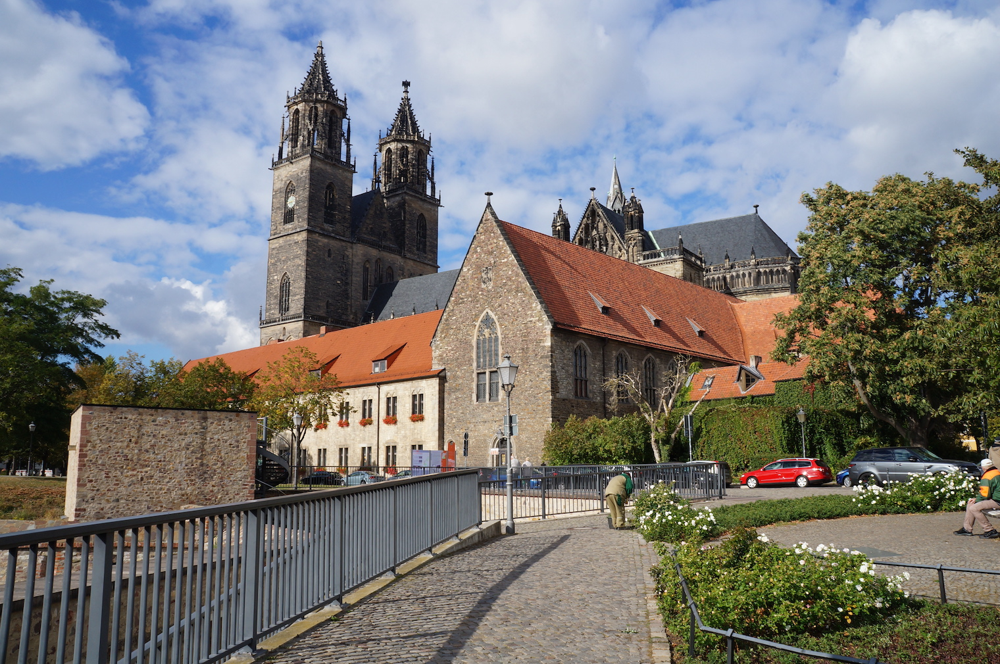
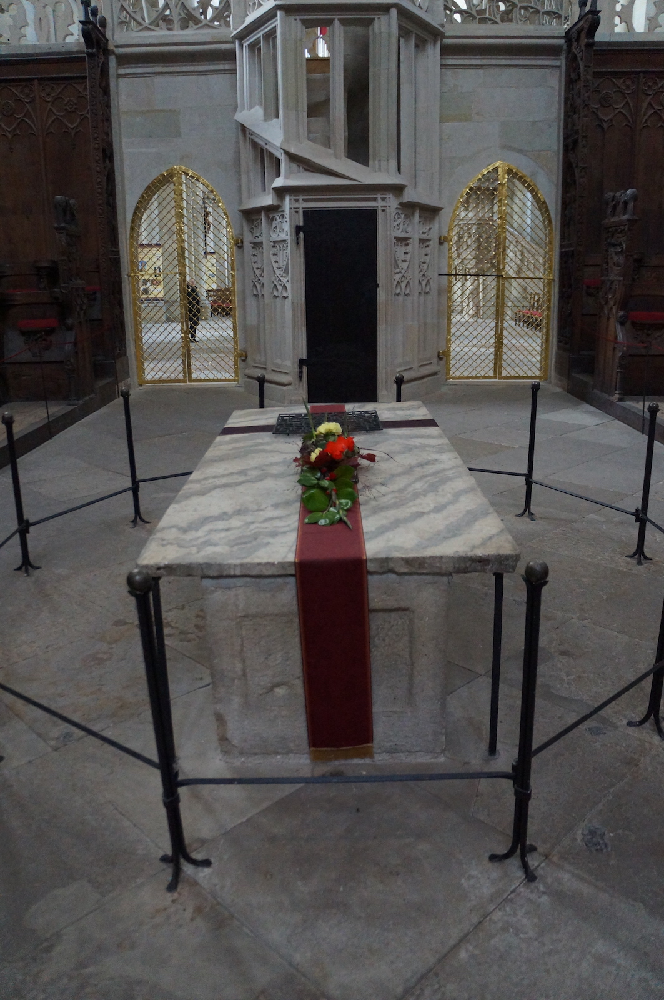
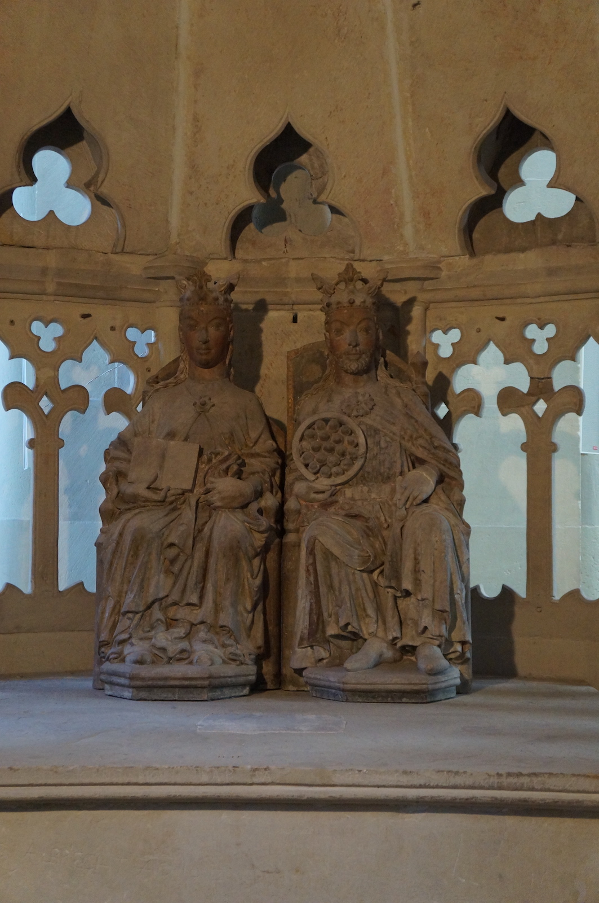
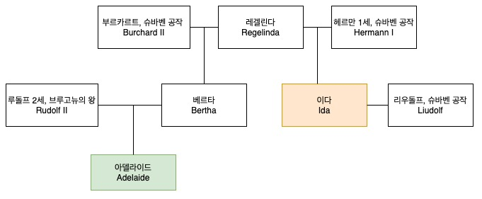

# 이탈리아 원정

국내 여행을 하다보면 각 지자체마다 유명 역사 인물을 엮어 관광 마케팅에 사용하는 경우가 많다. 예를 들어 구리시는 고구려의 세력이 구리까지 다다렀다는 역사적 사실과 아차산성을 엮어 아예 고구려의 도시로 관광 홍보 포인트를 잡고 있으며, 전라좌수영이 있었던 여수는 아예 `충무공 코스`까지 만들어 놓았다. 특히 관광 자원이 빈약한 곳일 수록 역사 인물을 더 강조하는 측면이 있는데 독일 작센안할트주의 주도인 마그데부르크(Magdeburg) 역시 이에 속하지 않을까 싶다.

마그데부르크 시내 곳곳에 오토의 실루엣이 그려진 깃발이 펄럭이고, 마그데부르크 여행자 센터에 가보면 오토가 당신을 환영합니다(otto heißt willkommen), 오토가 당신을 초대합니다(otto lädt ein) 등등 온갖 곳에 오토를 들먹이니 그야말로 '오토의 도시'이다. 사실 마그데부르크처럼 오토의 흔적이 많이 남아있는 곳이 없다. 오토 왕가는 **작센 공작** 하인리히 2세로부터 시작했기 때문에 본거지는 현재 독일의 북쪽의 대부분, 과거에는 작센으로 불리는 지역이며 그 중에서도 마그데부르크는 오토 대제에게는 사실상 수도나 다름 없었기 때문이다.

오랜 역사를 가진 다른 유럽 도시처럼 구 도심지역(Altstadt)의 중심에는 마그데부르크 대성당(Magdeburger Dom)이 있는데, 이 성당은 독일에서 가장 오래된 고딕 양식의 성당이며, 그 높이는 100.98m로 독일 동부에서 가장 높다. 하지만 이 성당의 유명세는 단순히 성당의 하드웨어 때문만은 아니다. 마그데부르크 대성당이 가장 유명한 이유는 다름이 아니라 '대제'라 불리는 오토 1세의 무덤이 있기 때문이다. 오토 대제는 마자르족과의 전투에서 크게 이긴 레히펠트 전투 이후에 강화된 자신의 권력을 대내외에 보여주고자 마그데부르크 대성당 건립을 지시했고, 사후 이 곳에 묻혔다.

  
마그데부르크 대성당 전경. 직접 찍음

마그데부르크 중앙역에서 엘베강변으로 가는 큰 길을 따라가다가 엘베강을 따라 난 산책로를 따라 남쪽으로 쭉 내려가면 클레베 요새(Bastion Cleve)가 있다. 벽이 높지 않았기 때문에 대포가 발달한 중세 이후에 생긴 요새로 보인다. 그 요새에서 Am Dom 도로를 따라 걷다보면 마그데부르크 대성당에 다다를 수 있다. 다른 대성당과는 달리 4유로 정도의 입장료를 받으며, 사진찍는데도 돈을 내야한다.

성당 내부에는 오토 1세와 첫 번째 아내인 이디스(Edith)의 무덤이 있고, 한 가운데는 이 부부의 조각상이 있다.

  
오토 1세의 무덤. 성당 한 가운데에 있다. 직접 찍음

오토와 이디스의 석상. 직접 찍음

참고로 이디스는 드라마 라스트 킹덤(Last Kingdom)의 주인공 중 한 명이자, 영국 역사상 유일무이한 `대왕`칭호를 가지고 있는 알프레드 대왕의 손녀이다.

## 오토의 권력기반 강화

오토는 반란의 싹을 자르고자 공작 자리에 혈족을 등용하기 시작했다. 그 중심에는 마그데부르크 대성당에 나란히 묻힌 오토 대제와 이디스 사이에는 두 자녀가 있었다. 아들인 리우돌프(Liudolf, 930-957)와 딸 리우트가르데(Liutgarde, 932-953)가 주인공이 된다.

먼저 작센 공작이야 원래 오토의 차지였으며 에버하르트가 반란을 일으켰다가 쫓겨난 후 공석이 된 프랑켄 공작령을 자신이 직접 통치했다. 그러면 이제 남은건 슈바벤, 로트링겐, 바이에른 공작령이다. 먼저 로트링겐 공작령은 당시 전전왕 콘라트 1세의 외손자인 적공 콘라트(독: Konrad der Rote, 영: Conrad the Red)가 944년부터 다스리고 있었다. 오토는 947년 딸 리우트가르데와 적공 콘라트를 혼인시켜 사위로 들였다. 938년 반란을 일으켰다가 오토에게 축출된 에버하르트 바이에른 공작의 후임으로 오토에게 충성을 다했던 에버하르트 바이에른 공작의 삼촌 베르톨트가 바이에른 공작 자리에 올랐었다. 베르톨트가 947년에 죽은 후 바이에른 공작이 공석이 되자, 오토는 자신의 동생 하인리히를 임명하였다. 슈바벤 공작 헤르만은 아들없이 오직 딸 이다(Ida)만 있었는데, 오토의 아들 리우돌프와 947년 결혼하였고, 949년 헤르만 1세 사망 후 슈바벤 공작 자리는 리우돌프가 물려받았다.

이렇게 5대 공작령을 자신과 자신의 직계 혈족으로 채운 오토의 치세는 점점 더 견고해지는 듯 했다.

## 브루고뉴의 아델라이드

모든 일의 시작은 한 사람의 죽음으로부터 시작되었다. 950년 당시 이탈리아의 왕은 로타리오 2세(Lothario II)였다. 그는 이탈리아의 왕(rex Italiae)이라는 칭호를 가지고 있었지민, 그저 허울뿐인 왕이었고 실질적인 권력은 이브레아 후작 베렝가리오 2세(Berengario II)가 쥐고 있었다.

947년 로타리오 2세는 브루고뉴(독: 부르군트, Burgund)의 왕 루돌프 2세의 딸인 아델라이드와 결혼했다. 둘 다 어린 나이에 결혼했는데, 결혼 당시 로타리오 2세의 출생년도가 정확하지 않아서 추정을 못하지만 대략적으로 19~21세 정도, 아델라이드는 16세였다. 그러나 이 젊은 부부의 결혼 생활은 고작 3년 뿐이었다. 로타리오 2세는 950년 11월 22일에 토리노에서 대략 23세의 젊은 나이에 알 수 없는 이유로 갑자기 죽었다. 왜 죽었는지 직접적인 증거는 남아있지 않지만, 독살이 유력한 상황이었다. 로타리오 2세가 죽었을때 가장 이익을 보는 사람이 누구인지, 그리고 그가 죽고나서 어떤 일이 벌어졌는지 살펴보면 정황상 베렝가리오 2세가 유력한 용의자였다. 개인적인 의견으로 로타리오 2세가 죽었던 토리노는 베렝가리오 2세의 근거지인 이브레아 지방과 가깝기 때문에 더 의심이 간다.

베렝가리오 2세는 로타르 2세가 죽자마자 이탈리아의 왕이 되었다. 베렝가리오 2세는 정치적 입지를 강화하고자 과부가 된 아델라이드와 자신의 아들 아달베르토와 결혼을 강요했다. 아델라이드는 베렝가리오 2세의 요구를 거부했고, 코모(Como)성에 유폐되었다. 몇 달 후 코모에서 탈출한 아델라이드는 카놋사(Canossa)의 요새로 도망쳐 오토 1세에게 구원을 요청했다.

  
    

## 오토의 이탈리아 원정

950년 당시 슈바벤 공작은 오토 1세의 아들인 리우돌프(Liudolf)였다. 리우돌프는 의외로 아델라이드와 혈연으로 이어져 있었는데, 정리하자면 이렇다. 앞서 오토 1세가 직계 혈족을 공작의 자리에 임명했다는 사실을 언급한 적이 있다. 리우돌프는 슈바벤 공작 헤르만 1세의 딸 이다와 혼인한 후, 헤르만 1세 사후 슈바벤 공작을 물려받았다. 이다의 어머니는 쮜리히의 '레겔린다(Regelinda)'라 불리는 여인이었는데 레겔린다는 헤르만 1세의 전임 슈바벤 공작인 부르카르트 2세의 아내기도 했다. 즉 레겔린다의 재혼 상대가 헤르만 1세였던 것이다. 부르카르트 2세와 레겔린다 사이에서 베르타(Bertha)가 태어났는데 이 사람이 바로 아델라이드의 어머니가 되시겠다.

아델라이드의 구원 소식을 들은 리우돌프는 오토 1세의 승인을 받지도 않고 951년 초 슈바벤 군대를 이끌고 알프스를 넘어 롬바르디아를 침공했다. 침공한 이유는 정확하게 알 수가 없다. 다만 몇 가지 설이 있는데,

1. 친척의 구원 요청을 보고 지나칠 수 없어서
2. 북부 이탈리아가 탐이 나서
3. 후계자로서 전공 쌓기

다만 이 무단 행동은 두 사람의 심기를 매우 불편하게 했다. 한 사람은 물론 오토 1세이며 다른 한 사람은 오토 1세의 동생이자 바이에른 공작 하인리히였다. 오토 1세는 자기의 아들이 자신의 허락을 받지 않고 독단적으로 행동한데 화를 냈고, 이탈리아 북부는 오래 전부터 바이에른 공작들이 늘 관심을 보인 지역이었는데 난데없이 슈바벤 공작이 군대를 이끌고 오니 하인리히는 그저 심사가 뒤틀릴 따름이었다. 아군에게서 아무런 지원을 받지 못했던 리우돌프의 원정은 실패로 돌아갔고, 결국 뒤따라오는 오토 1세의 군대를 기다릴 수 밖에 없었다. 아마도 아버지인 오토 1세로부터 심한 질책을 들었을걸로 생각되는데 이 사건은 훗날 큰 돌풍이 되어 돌아오게 된다.

한편 오토 1세는 아델라이드의 구원요청을 받고 바로 응했다. 오토는 평소에도 이탈리아에 큰 관심이 있었던데다가, 마침 아내였던 이디스가 946년에 죽어서 마그데부르크에 묻힌 이후에 홀아비 상태였기 때문에, 아델라이드와의 결혼으로 이탈리아의 황제가 될 좋은 기회였다. 951년 9월 카놋사에 갖혀있던 아델라이드를 구한 오토 1세는 그해 10월 파비아에서 아델라이드와 결혼하고 이탈리아 왕까지 겸하게 되었다. 다만 내심 로마 황제까지 욕심을 냈던 오토 1세는 로마의 아가피토 2세(Agapet II) 교황에게 로마 황제로서의 대관을 요구했으나 거절당했다.

오토와 아델라이드의 결혼 직후인 11월, 리우돌프는 아버지에게 작별인사도 없이 오토의 정적인 프리드리히 폰 마인츠 대주교와 함께 슈바벤으로 돌아갔다. 자신의 불쾌함을 노골적으로 표현한 이 행위는 오토에게는 모욕이나 다름없었다. 리우돌프는 부왕에게 대놓고 모욕적인 행위를 한 이유는 무엇이었을까.

  
오토 1세와 베렝가리오 2세. 가운데 왕관을 쓰고 앉아있는 사람이 오토 1세, 그 왼쪽에서 무릎을 꿇고 검을 쥐고 있는 사람이 베렝가리오 2세다.

가장 큰 이유는 아델라이드와 부왕 오토 1세의 결혼 때문이었다. 동서고금을 막론하고 후처가 권력을 이을 수 있는 아들을 낳고난 후 궁궐에 피바람이 부는 일이 적지 않았다. 멀리 갈 것도 없이 조선 태조 때 "제1차 왕자의 난" 역시 후처의 자식인 의안대군 방석이 세자로 책봉되자 이방원(추후 태종)이 일으킨 일이지 않은가. 리우돌프의 불안도 똑같았다. 오토와 첫 번째 왕비인 이디스와의 장남으로 태어난 리우돌프는 오랜 기간동안 오토의 후계자로 자라왔지만 앞으로 아델라이드와 아버지 사이에서 자식, 특히 남자가 태어나면 자신의 처지가 어떻게 될지 모른다는 불안감이 있었다.

또 다른 이유는 이탈리아 원정 후의 논공 행상과 삼촌인 바이에른 공작 하인리히의 영향력이 점점 커지고 있었기 때문이었다. 오토의 동생 하인리히는 부왕에게 여러 번 반기를 들었으나 할머니가 적극적으로 감싼 덕분에 끝까지 목숨을 부지했고 혈육이라는 이유로 바이에른 공작의 자리에까지 오른 인물이다. 적어도 리우돌프에게는 이렇게 비춰진 얄미운 인물이었다. 이런 자가 논공행상에선 로트링겐 공작 콘라트와 더불어 가장 큰 공을 세운 자가 되었고, 자신의 공적은 철저하게 무시되었다. 게다가 하인리히는 이번 원정에서 자신을 방해하기까지 한 인물이었다. 리우돌프는 어느순간 부왕의 오른팔이 되어버린 하인리히가 자신을 몰아내지 않을까 경계하기 시작했다.
