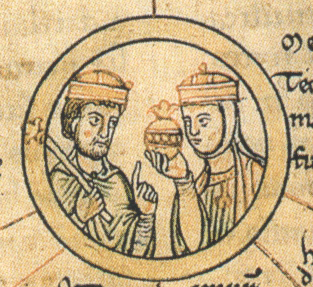
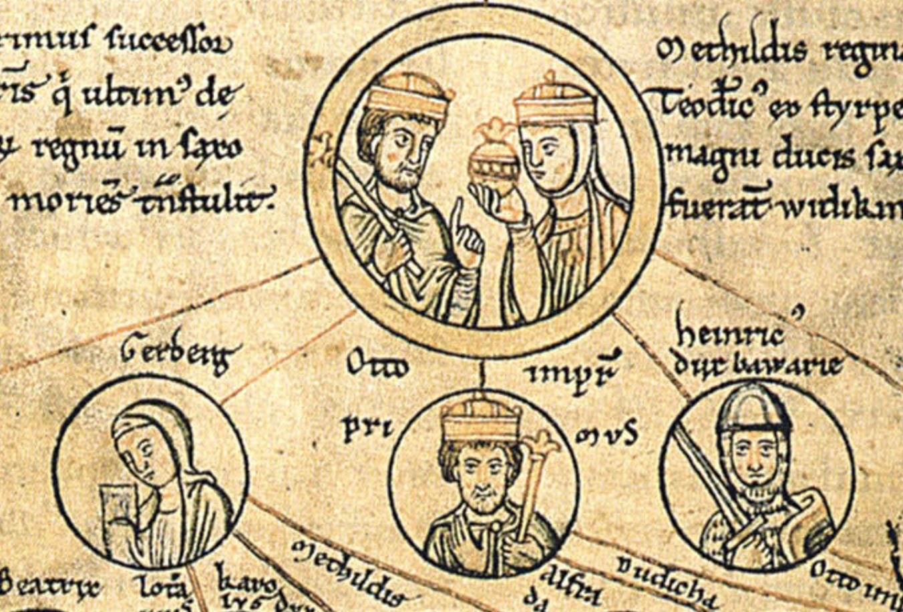

#  오토 대제의 등장

하인리히 1세와 선왕 콘라트 1세의 공통점은 무엇일까? 둘 다 국왕 선거로 뽑힌 왕이다. 이는 얼핏 혈통보다는 정치와 실력으로 누구나 국왕이 될 수 있다는 말로 들리지만 모순적이게도 독일 왕은 무엇보다도 혈통 중심이었다. 국왕 선거는 게르만의 오래된 관습이지만, 이 선거에 나설 수 있는 후보자는 전왕의 혈연자로 한정되었다. 그리고 전왕은 후계자를 지명할 권리를 갖고 있었다. 따라서 국왕 선거는 새로운 왕이 그저 전왕의 혈연자라서 왕이 된 것이 아니라 국왕에 어울리는 사람이라서 모두의 추대를 받아 왕위에 올랐다는 것을 보여주기 위한 형식적인 절차에 불과했다. 동서고금을 막론하고 명분은 중요한가 보다. 비슷한 예로는 조선시대 단종과 수양대군의 예를 들 수 있겠다. 계유정난 이후 수양대군은 조선의 실질적인 왕이었다. 자기 스스로 왕위에 오를 수도 있겠지만, 정당성과 형식 때문에 수하인 한명회와 권람을 시켜(혹은 정황상 신하들이 알아서) 수양대군에게 양위하라고 단종을 겁박한다. 수양대군은 왕위를 물려준다는 단종의 거듭된 요청으로 "어쩔 수 없이" 왕위를 받게 된다.

하인리히 1세와 아내 마틸다

하지만 모든 일에는 예외가 있듯이 아무리 국왕 선거가 형식에 불과하더라도 진짜 선거다운 선거를 해야 할 때가 있다. 선왕의 혈통이 끊어졌을 경우나 전왕이 지명한 후계자가 국왕이 되기에 너무나도 어울리지 않았을 경우다. 실질적인 독일 왕국의 시작인 콘라트 1세 때는 전왕 루트비히 4세가 혈통이 없이 죽어서 왕으로 선출되었고 하인리히 1세는 콘라트 1세가 후계자로 지명함으로써 독일 왕이 되었다. 그리고 하인리히 1세는 929년 둘째 아들 오토(Otto)를 후계자로 지명했고 936년 하인리히 1세가 사망한 후 작센과 프랑켄 귀족들의 만장일치로 왕위에 올랐다. 

<ins class="adsbygoogle"
     style="display:block; text-align:center;"
     data-ad-layout="in-article"
     data-ad-format="fluid"
     data-ad-client="ca-pub-3240698473669508"
     data-ad-slot="6008361880"></ins>

하인리히를 지칭하는 말 중에 라틴어로 "Primus inter pares"라는 말이 있다. '동료 중 일인자'라는 뜻으로 하인리히는 독일 왕임에도 불구하고 대공을 지배하는 자가 아닌 '여러 대공 중 일인자'라는 입장을 견지했다. 태생이 작센 공작이라 그런지 아니면 여러 공작들의 반란을 진압하다가 제 명대로 못 산 선왕 콘라트 1세의 참상을 두 눈으로 몸소 겪어서 그런지 알 수는 없다. 따라서 '여러 대공 중 일인자' 하인리히 1세는 다른 공작들과 분쟁을 감수하고 강력한 중앙집권 체제를 구축하는 대신 평화로운 연맹 체제를 선호했다. 반면 하인리히 1세의 뒤를 이어 독일 왕위에 오른 이른바 오토 1세, 혹은 오토 대제(독: Otto der Große, 영: Otto the Great)라고 후세에 불리는 오토는 부왕과는 달랐다.

오토는 대관식을 통해 자신이 다른 대공들보다 높은 위치에 있다는 생각을 공공연하게 드러냈다. 936년 독일 아헨(Aachen)에서 열린 오토의 대관식에는 다른 4대 대공 - 바이에른, 슈바벤, 프랑켄, 로트링겐 -이 오토의 개인적인 수행원 역할을 했다. 먼저 아헨이 로트링겐 공작령에 속해있었기 때문에 길베르트 로트링겐 공작은 대관식에 필요한 모든 물자를 담당했다. 프랑켄 공작 에버하르트는 연회를 담당하고, 슈바벤 공작 헤르만은 컵을 운반하는 직책을 맡았다. 바이에른 공작 아르눌프 1세는 말을 감독하고 캠프를 만들 장소를 정하고 관리했다. 대공들이 이런 직책을 맡음으로써, 대공들은 새로운 왕에게 복종하고 협력하겠다는 뜻을 분명히 했다.

오토 1세에 대한 다른 공작들의 태도는 선왕 콘라트 1세, 하인리히 1세 때와 확연히 달라졌다. 위 두 왕은 즉위한 직후 자신을 왕으로 인정하지 않았던 다른 공작들과 치열하게 싸웠던 과거가 있었기 때문이다. 여기까지만 보면 "이렇게 해서 오토 1세는 평화롭게 독일 왕국을 다스렸답니다"라는 말로 끝날 듯 싶다. 하지만 이번에는 다른 형제들과 다툼이 새로운 왕의 발목을 잡았다.

---

앞서 1편에서 프랑크 왕국에 대해 짧게 설명한 적이 있다. 현재 독일, 프랑스, 스위스, 이탈리아 북부 등의 현재 서유럽 대부분을 프랑크 왕국의 기치 아래 통일시켰던 카롤루스 대제(프: 샤를마뉴, 독: 카를, 영: 찰스)가 죽은 후 베르됭 조약을 통해 넓은 왕국이 세 개의 왕국(동/중/서 프랑크 왕국)으로 쪼개졌다. 동양이나 로마 제국과는 달리 게르만족에게는 토지와 재산을 남자에게 균등하게 상속하는 제도가 있었기 때문이다. 이 제도 때문에 게르만족이 지배하던 서유럽은 상속으로 나라가 쪼개졌다 합쳐지는 일이 빈번했다. 하인리히 1세는 자신의 사후 이 관습 때문에 왕국이 쪼개질까 우려하였다. 이에 하인리히는 929년 둘째 아들 오토를 독일 왕국의 유일한 후계자로 선언하고 모든 토지와 재산은 오토가 물려받도록 정했다. 이른바 장자 상속제를 명문화함으로써 향후 독일 왕국의 발전에 기틀을 마련한 셈이다.

왕국이 분열되지 않기를 바랐던 부왕 하인리히의 희망과는 달리 오토의 동생인 하인리히는 분할 상속 관습을 들어 자신에게도 왕위 계승권이 있다고 주장했다. 이에 힘을 실어준 이는 다름 아닌 오토와 하인리히의 어머니인 마틸다였다. 마틸다는 작은 아들 하인리히를 편애했는데 결론적으로 마틸다의 편애가 두고두고 큰 아들 오토를 괴롭히게 된다.

맨 위가 하인리히 1세와 마틸다. 그 아래 열은 왼쪽부터 게르베르가, 오토 1세, 하인리히(출처: [위키피디아](https://commons.wikimedia.org/wiki/File:StammtafelOttonen0002.jpg), Public Domain, 일부 수정해서 사용)

이복형 탕크마르(Thankmar)도 오토에 등을 돌렸다. 하인리히 1세가 '장자 상속제'를 명문화했는데 오토에게 형이 있다는 사실 - 즉 오토가 제일 맏아들이 아닌데 어떻게 '장자'가 될 수 있는가 의문을 가지실 분들을 위해 짧게 설명하겠다. 사실 하인리히 1세가 서른 살이었던 906년, 메르세부르크(Merseburg) 백작 에르빈(Erwin)의 딸 하테부르크(Hatheburg)와 결혼해서 아들 탕크마르를 얻었다. 하지만 하테부르크는 이번이 두 번째 결혼이었다. 당시 여자의 중혼은 한국의 조선시대와는 달리 사회적으로 전혀 문제가 없었다. 실제로 오토 1세의 누이 게르베르가도 로트링겐 공작 기셀베르트와 결혼 후 프랑스의 루이 4세와 결혼했으며 오토 1세도 늘그막 한 나이에 20대 미망인과 혼인한 적이 있다. 다만 하테부르크의 경우 문제가 되었던 게 하인리히 1세와 결혼 당시 하테부르크는 수녀였다는 게 큰 문제였다. 교회에서는 하테부르크가 첫 결혼 후 남편과 사별하고 수녀가 되었고, 수녀 시절의 순결 서약이 아직 유효하다면서 혼인 자체를 위법으로 보았다. 결국 두 사람은 이별할 수밖에 없었다. 하테부르크는 다시 수녀가 되었고 하인리히는 베스트팔리아 백작의 딸 마틸다와 결혼하게 되었다. 따라서 탕크마르는 적통성에 문제가 있었기 때문에 하인리히의 둘째 아들인 오토에게 후계자 자리가 넘어갔던 것이다. 12세기에 작성된 오토 왕조의 족보도 이를 뒷받침한다. 하인리히 1세의 후계자들의 얼굴이 그려진 오토 왕조의 족보의 어디에서도 탕크마르의 이름이 보이지 않는다.

상속 문제 때문에 하인리히와 탕크마르는 오토에게 불만은 있었지만 오토가 즉위하자마자 반란을 일으킨 건 아니었다. 오토는 즉위 후 헤르만 빌룽(Hermann Billung)을 작센 서북쪽의 변경백으로 임명했는데 이 인사가 뜻하지 않게 반란의 도화선이 되었다.