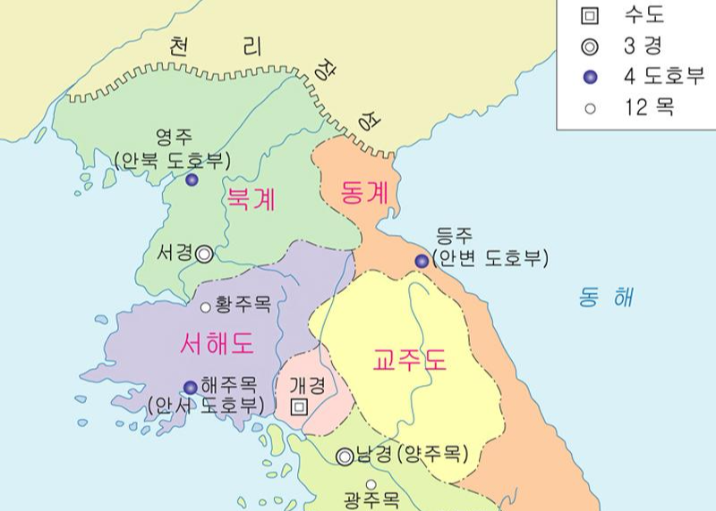

# 반란의 시대

## 변경백 게로

'변경백(邊境伯)'이란 독일어로 Markgraf라고 하는데, 이는 변경(Mark)과 백작(Graf)이 합쳐진 단어다. 영어의 Margrave의 어원도 이 Markgraf이다. 변경백은 외적의 침입이 잦은 국경 지대를 다스리기 위해 임명되었는데 다른 백작과 크게 다른 점은 군사권뿐만 아니라 변경백이 관할하는 지역 내에서 행정권과 사법권도 행사할 수 있다는 점이다. 변경백의 제일 중요한 역할은 외부의 침략을 방어하는 일이다. 필요하다면 선제공격도 가능했기 때문에 능력이 되면 얼마든지 영토를 늘리는 것도 가능했다. 이 때문에 변경백은 다른 백작보다 막강한 권력을 누렸다.

동서고금을 막론하고 한 국가의 통치 기틀이 확립되면 보통 행정/사법/군사권이 나눠지기 마련이지만 군사적인 압력을 심하게 받는 시기와 장소에 따라 통치 효율성을 위해 예외적으로 행정/사법/군사권을 원스탑 서비스로 처리하는 직책이 생기곤 했다. 물론 변경백은 신성 로마제국 고유의 직책이지만 동서양을 살펴보면 이와 비슷한 직책을 찾는 건 어렵지 않다. 중고등학교 시절 한국사 단골 시험 문제였던 고려의 행정구역을 떠올려보자. 고려는 현종 때 전국을 5도 양계(五道 兩界)로 나누었다. 양계는 거란의 군사적 위협이 큰 평안도 지역(북계)과 여진족과 분쟁이 잦은 함경도 지역(동계)을 말하며 이 양계에 파견되는 관리가 병마사(兵馬使)다. 병마사는 군사권뿐만 아니라 행정권도 가지고 있었다. '안사의 난'으로 유명해진 안녹산(安祿山) 역시 당나라가 돌궐을 막기 위해 북쪽에 파견되어 있는 절도사였고, 이 절도사 역시 병마사처럼 해당 지역의 군권과 행정권을 모두 가지고 있었다.

오토는 즉위 직후 헤르만 빌룽(Hermann Billung)을 작센 서북쪽의 변경백으로 임명했다. 당시 작센의 서쪽은 슬라브족과 교전이 잦은 지역이었다. 이 인사는 헤르만의 형 비히만(Wichmann) 백작의 심기를 건드렸다. 비히만은 자신이 동생인 헤르만보다 더 나이가 많고 부유하기 때문에 변경백에 적합한 사람이라고 믿고 있었다. 게다가 비히만은 선왕 하인리히 1세의 아내 마틸다의 누이와 결혼한 사이였다. 헤르만보다는 좀 더 "로열 패밀리"에 가까운 사람이었기 때문에 더욱더 심기가 불편했다.

이 사실을 모르는지 알고도 모른 척했는지 오토는 937년 작센 서쪽 변경백인 지크프리트(Siegfried)가 죽자 지크프리트의 동생인 게로(Gero)에게 변경백 작위를 계승시켰다. 이는 또 한 사람을 화나게 했는데, 오토의 이복형이자 지크프리트의 사촌인 탕크마르였다. 탕크마르 역시 비히만처럼 자신이 변경백이 되기에 더 적합한 인물이라 생각하고 있었다. 여기에 왕위 계승권이 있다고 주장하는 오토의 동생 하인리히까지 잠재적 반란자들은 늘어갔다.

맨 위의 노란색이 작센 공작령, 그 오른쪽이 헤르만이 임명된 변경백(MARCH OF BILLUNGS) 그 아래가 게로가 임명된 변경백 (출처: [위키피디아](https://commons.wikimedia.org/wiki/File:Central_Europe,_919-1125.jpg), Public Domain)

프랑켄 공작도 오토에게 등을 돌렸다. 계기는 프랑켄과 작센의 국경지대에서 발생한 무력충돌이었다. 브루닝(Bruning)이라 불린 작센의 귀족은 프랑켄 공작령과 작센 공작령 사이의 경계 지방을 지배하고 있는 지방 귀족이었다. 브루닝은 자신은 작센인이 아닌 귀족의 명령에 복종할 수 없다며 프랑켄 공작 에버하르트의 명령을 거부하는 일이 생겼다. 비두킨트의 사료에 따르면 당시 작센 인들은 자신의 공작이 왕이 되었다는 자부심이 굉장히 컸다. 화가 난 에버하르트 프랑켄 공작(전전왕 콘라트 1세의 동생. 참고 : 2편 3편)은 브루닝을 공격, 헬메른(Helmern) 성의 주민을 모두 죽이고 성을 불태웠다. 오토는 독일 왕으로 이 사건에 개입, 양 측을 자신이 머물고 있던 마그데부르크(Magdeburg)에 불렀다. 오토는 에버하르트에게 100 파운드의 벌금을 부과했다. 여기에 덧붙여 에버하르트 휘하의 지휘관들에게는 개를 끌고 마그데부르크의 모든 거리를 다니라는 형벌을 내렸다. 이를 독일어로 'Hundetragen'라고 하는데 당시 귀족으로서는 굉장히 치욕적인 형벌이었다.

Hundetragen (© Stadtmuseum Berlin | Foto: Michael Setzpfandt, Berlin)

사실 에버하르트가 주제넘은 행위를 한 건 사실이다. 하지만 에버하르트 입장에서는 매우 서운했을 것이다. 형인 콘라트 1세의 뒤를 이어 자신이 왕에 오를 수도 있었지만, 형의 유지를 받들어 작센 공작 하인리히 1세에게 독일 왕위를 물려줬다. 게다가 프랑켄 공작에 오르고 나서도 하인리히 1세를 끝까지 지지했고, 이에 하인리히도 에버하르트를 전폭적으로 신뢰했다. 단적인 예로 하인리히 1세가 로트링겐 지방을 점령한 직후 2년 동안 에버하르트에게 로트링겐 지방의 섭정을 맡기기도 했다. 현재 독일 왕인 오토의 즉위에도 프랑켄 공작의 지지가 큰 힘이었다. 그렇지만 오토는 에버하르트에서 100파운드의 벌금과 수하들에게는 치욕을 안겨주었다. 참고로 당시는 1파운드가 20 실링(shilling)였고, 칼 한 자루가 5실링이었기 때문에 벌금 100파운드는 검 400 자루에 해당하는 금액이었다. 에버하르트가 얼마나 부유했는지에 대한 기록이 없어 단언할 수는 없지만 독일의 5대 공작 중 한 명이었기 때문에 그리 크지 않은 금액이라고 예상해본다. 문제는 자신의 상처 입은 자존심일 테다. '내가 너한테 이렇게 잘 했는데 어떻게 나한테 이럴 수 있어'라는 서운함이 크지 않았을까.

반란의 도화선에 불을 붙인 사건은 새로이 바이에른 공작이 된 에버하르트의 반란이었다. 937년 바이에른 공작 아르눌프(Arnulf)가 죽었다. 오토의 대관식에서 말과 캠프를 담당했던 바로 그 공작이다.(참고 : 7편) 바이에른 공작직은 아들인 에버하르트가 이어받았다. 프랑켄 공작 에버하르트와는 동명이인인 바이에른 공작 에버하르트는 즉위 후 자신의 아버지와 오토의 아버지 하인리히가 맺었던 평화조약(참조 : 3편)에 이의를 제기하고 오토를 왕으로 인정하지 않았다. 즉, 반란이었다. 이와 동시에 오토에게 서운한 감정이 많던 프랑켄 공작 에버하르트, 오토의 이복형 탕크마르, 작센 서북쪽 변경백 헤르만의 형 비히만과 마인츠(Mainz)의 대주교 프레드릭도 반란을 일으켰다.

## 반란, 반란

독일 왕 오토 1세에게 938년은 안정적인 통치를 위한 분기점이었다. 반란을 일으킨 공작들에게 패하거나 약한 모습이라도 보이면 남은 치세 동안 공작들을 제어하기가 힘들어진다. 오토에게 반기를 든 세력은 꽤 컸다. 독일 5대 공작(작센, 바이에른, 프랑켄, 슈바벤, 로트링겐) 중 바이에른 공작과 프랑켄 공작이 반란에 가담했다. 오토의 칼 끝은 바이에른으로 먼저 향했다. 938년 봄과 가을 두 차례 원정을 통해 바이에른의 반란을 진압했다. 그 후 바이에른 공작 에버하르트를 공작 직위에서 끌어내리고 바이에른 공작 에버하르트의 삼촌 케른텐 변경백 베르톨트를 새로운 바이에른 공작에 임명했다. 베르톨트는 오토에게 충성을 맹세함으로써 바이에른의 반란을 잠재울 수 있었다. 참고로 케른텐은 영어로 Carinthia, 독일어로는 Kärnten로서 현재 오스트리아 일부 지방이다. 

한편 프랑켄 공작 에버하르트, 비히만 백작(8편 참고)과 연합한 탕크마르는 대군을 움직여서 벨레케(Belecke)에 있는 요새를 공격했다. 벨레케는 현재 독일의 중부 노르트라인베스트팔렌 주 바스타인(Warstine) 근처에 있는 곳이다.  벨레케라는 지명은 이때 처음 역사에 기록이 남을 정도로 전략적 요충지라던가 대도시는 아니었다. 다만 이 요새에는 향후 전황을 유리하게 이끌 수 있는 귀중한 사람 - 오토의 친동생이자 자신의 이복동생인 하인리히가 머물고 있었다.(여담이지만 바스타인은 요즘 편의점이나 마트에서 파는 맥주 바스타이너(Warstiner)의 원산지로 유명한 곳이다.)

  
    <!--Load the API from the specified URL
    * The async attribute allows the browser to render the page while the API loads
    * The key parameter will contain your own API key (which is not needed for this tutorial)
    * The callback parameter executes the initMap() function
    -->
    

belecke 위치. 좌측에 도르트문트, 쾰른. 우상단에 하노버가 있다.(출처: 오픈스트리트 맵)

탕크마르는 벨레케 전투에서 승리, 왕의 친동생을 손에 넣었지만 그 반대 급부로 슈바벤 공작 헤르만이 확실하게 적으로 돌아섰다. 벨레케 전투에서 프랑켄 공작 에버하르트의 친척이자 슈바벤 공작의 사촌인 게브하르트(Gebhard)가 탕크마르에 맞서 싸우다 전사한 것이다. 슈바벤 공작 헤르만은 백작 시절부터 오토 왕조에 충성스러웠고 그래서 공작자리에 올랐다. 따라서 오토 왕조에 반기를 드는 반역자들을 앞장서서 처단해야 하지만 이번에는 사정이 좀 복잡했다. 이번 반란의 중심에는 자신이 속해있는 콘라드 집안의 최고 연장자인 에버하르트 프랑켄 공작이 있었기 때문이다. 헤르만은 분명 갈등했을 것이다. 다만 벨레케 전투에서 게브하르트가 전사함으로써 헤르만의 갈등은 확실하게 정리되었다. 게브하르트의 전사로 인해 프랑크(독일) 지도자들이 분열되었다는 사료를 볼 때, 사촌인 게브하르트가 전사한 후 헤르만은 확실하게 반 에버하르트, 친 오토로 돌아섰다. 

한편 탕크마르는 에레스부르크(Eresburg) 성을 장악하고 여기에 많은 주둔군을 상주, 향후 반란을 위한 전초기지로 삼았다. 왕의 동생 하인리히의 신병은 프랑켄 공작 에버하르트가 책임졌다. 하지만 기세 좋던 탕크마르의 반란은 에레스부르크에서 끝났다. 에레스부르크 점령 즈음 반란의 한 축이었던 비히만이 오토에 복종하고 오토도 사태의 심각성을 느껴 대군을 이끌고 에레스부르크로 다가오고 있었다. 탕크마르는 당연히 공성전을 대비했지만 에레스부르크의 주민들은 전혀 그럴 생각이 없었다. 자신에게 다가오는 자가 왕인 오토였고 수많은 군대를 이끌고 왔음을 알고 몰래 성문을 열고 왕의 군대를 에레스부르크로 끌여들였다. 

938년 7월 28일, 오토의 군대는 에레스부르크로 진입했다. 탕크마르는 에레스부르크 성 안의 교회로 도망쳤다. 동생 하인리히의 부하들이 탕크마르의 뒤를 쫓았다. 탕크마르는 무기와 금 목걸이를 내려놓고 제단 옆에 서있었다. 이는 자신의 모든 권리를 내려놓는다는 의미 - 즉 항복의 의미였다. 하지만 주군의 복수에 혈안이 된 하인리히의 수하들은 탕크마르를 용서하지 않았다. 티아볼트(Thiabold)라고 하는 병사는 창으로 탕크마르의 등을 찔렀다. 탕크마르로서는 의외의 기습이었지만 티아볼트의 바람대로 얌전히 죽지 않았다. 비두킨트의 사료에 따르면 탕크마르는 비록 전장에서 두각을 나타내진 못했지만 용맹하고 수많은 전쟁터를 헤쳐온 사람이었다. 창으로 탕크마르를 찌른 티아볼트는 탕크마르의 반격에 고통스럽게 죽었다. 그 순간이었다. 탕크마르 뒤에 있던 창문이 깨지면서 창 하나 불쑥 튀어나왔다. 그 창은 다시 한번 탕크마르의 등에 꽂혔다.